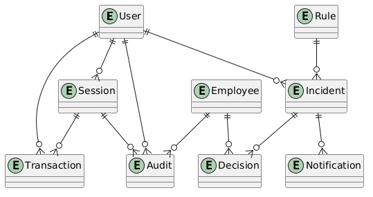
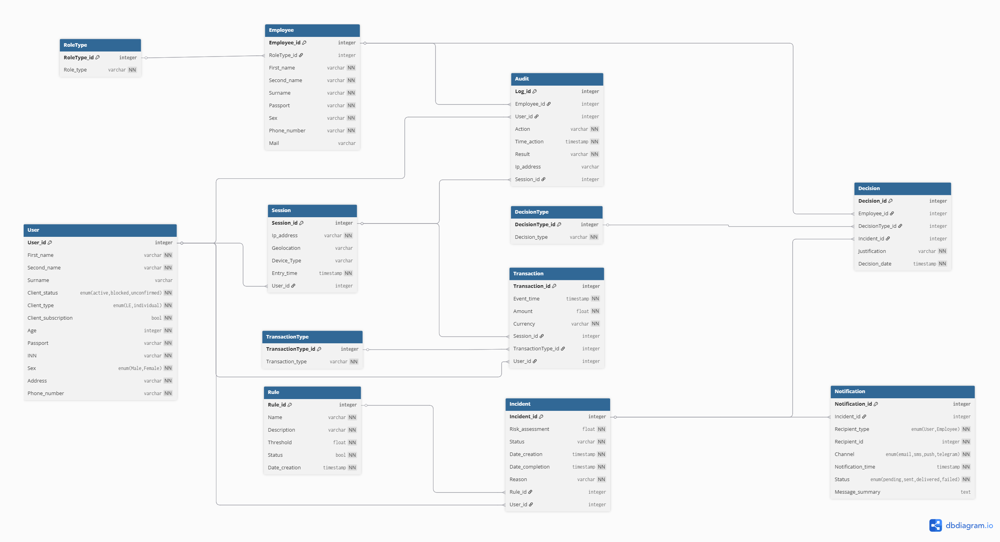
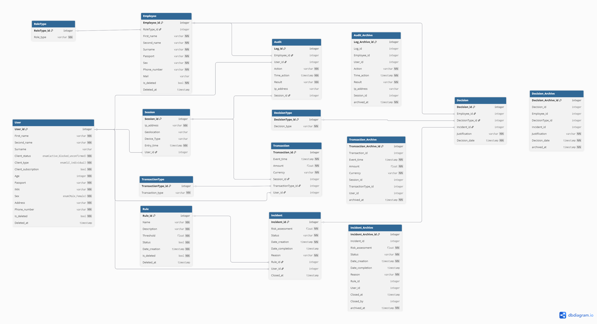

# Модель данных

## Концептуальная модель данных

Концептуальная модель отражает бизнес-сущности и связи между ними без привязки к конкретной СУБД или физическому хранению. Она описывает, какие объекты важны для предметной области и как они соотносятся друг с другом.

**Основные концептуальные сущности:**

1. **Пользователь** — клиент банка, совершающий операции в ДБО.
2. **Транзакция** — финансовое событие (платёж, перевод и т.п.).
3. **Сессия** — контекст подключения пользователя (устройство, IP, геолокация).
4. **Правило** — условие детекции подозрительной активности.
5. **Инцидент** — факт срабатывания правила с оценкой риска.
6. **Сотрудник** — аналитик или сотрудник ИБ, работающий с инцидентами.
7. **Решение** — результат ручного рассмотрения инцидента.
8. **Аудит** — журнал всех действий в системе.
9. **Уведомление** — факт отправки оповещения об инциденте.

**Концептуальные связи:**

- Пользователь инициирует Транзакции и Сессии.
- Сессия объединяет несколько Транзакций.
- Правило срабатывает на Транзакции и порождает Инцидент.
- Инцидент связан с Пользователем и Правилом.
- Сотрудник выносит Решение по Инциденту.
- Аудит фиксирует действия Сотрудника и Пользователя.
- Уведомление привязано к Инциденту и получателю.

Концептуальная модель служит основой для построения логической и физической моделей, описанных ниже.

## Логическая модель данных

Логическая модель конкретизирует концептуальную структуру: определяются атрибуты сущностей, их типы, первичные и внешние ключи, а также нормализация и ограничения целостности. Эта модель не зависит от конкретной СУБД, но уже близка к реализации.

В системе выделены следующие логические сущности (подробно раскрыты в разделах «Основные сущности» и «Связи между сущностями»):

- **User** (Пользователь) — идентификатор, имя, статус, паспортные данные, ИНН.
- **Transaction** (Транзакция) — идентификатор, ссылки на пользователя и сессию, тип, сумма, валюта, время.
- **Session** (Сессия) — идентификатор, ссылка на пользователя, IP, геолокация, тип устройства, время входа.
- **Rule** (Правило) — идентификатор, название, порог, статус.
- **Incident** (Инцидент) — идентификатор, ссылки на пользователя и правило, оценка риска, статус.
- **Employee** (Сотрудник) — идентификатор, роль, имя, паспорт.
- **Decision** (Решение) — идентификатор, ссылки на инцидент и сотрудника, тип решения, дата.
- **Audit** (Аудит) — идентификатор, ссылки на пользователя, сотрудника и сессию, действие, время.
- **Notification** (Уведомление) — идентификатор, ссылка на инцидент, тип получателя, канал, время, статус, сводка.

**Основные ограничения логической модели:**

- Каждая сущность имеет первичный ключ (PK).
- Внешние ключи (FK) обеспечивают ссылочную целостность (например, `Transaction.User_id` ссылается на `User.User_id`).
- Модель приведена к третьей нормальной форме (3NF) с осознанной денормализацией в таблицах `Transaction` и `Audit` (дублирование `User_id` для производительности).

Детальное описание атрибутов, типов данных, связей с кратностью, а также вопросы нормализации, индексации, партиционирования и физического хранения приведены в последующих разделах.

## Общая информация

Модель данных предназначена для хранения и обработки информации о пользователях, транзакциях, сессиях, правилах, инцидентах, решениях и уведомлениях в системе мониторинга подозрительной активности.

Система использует гибридный подход:
1. **OLTP (реляционная БД)** — для хранения актуальных данных и транзакционной обработки
2. **DWH (хранилище данных)** — для аналитики, отчётов и агрегатов
3. **Event Streaming** — для обработки событий в реальном времени

## Основные сущности

### Пользователь (User)

Хранит информацию о клиенте банка.

**Ключевые атрибуты:**
1. User_id (PK)
2. First_name
3. Second_name
4. Client_status
5. Client_type
6. Passport
7. INN

**Назначение:**
Используется для идентификации клиента и анализа его поведения.

### Транзакция (Transaction)

Хранит информацию о финансовых операциях.

**Ключевые атрибуты:**
1. Transaction_id (PK)
2. User_id (FK)
3. Session_id (FK)
4. TransactionType_id (FK)
5. Event_time
6. Amount
7. Currency

**Назначение:**
Основная сущность для анализа подозрительной активности.

### Сессия (Session)

Хранит информацию о пользовательских сессиях.

**Ключевые атрибуты:**
1. Session_id (PK)
2. User_id (FK)
3. Ip_address
4. Geolocation
5. Device_type
6. Entry_time

**Назначение:**
Позволяет анализировать поведение пользователя и выявлять аномалии (например, смену IP или устройства).

### Правило (Rule)

Описывает правила детекции подозрительных операций.

**Ключевые атрибуты:**
1. Rule_id (PK)
2. Name
3. Threshold
4. Status

**Назначение:**
Используется модулем правил для выявления подозрительных событий.

### Инцидент (Incident)

Фиксирует подозрительные события.

**Ключевые атрибуты:**
1. Incident_id (PK)
2. User_id (FK)
3. Rule_id (FK)
4. Risk_assessment
5. Status

**Назначение:**
Хранит результат анализа и используется для расследования.

### Сотрудник (Employee)

Хранит данные сотрудников банка.

**Ключевые атрибуты:**
1. Employee_id (PK)
2. RoleType_id (FK)
3. First_name
4. Passport

**Назначение:**
Используется для фиксации действий аналитиков и сотрудников ИБ.

### Решение (Decision)

Фиксирует решения по инцидентам.

**Ключевые атрибуты:**
1. Decision_id (PK)
2. Incident_id (FK)
3. Employee_id (FK)
4. DecisionType_id (FK)
5. Decision_date

**Назначение:**
Хранит результат расследования инцидента.

### Аудит (Audit)

Хранит журнал действий в системе.

**Ключевые атрибуты:**
1. Log_id (PK)
2. User_id (FK)
3. Employee_id (FK)
4. Action
5. Time_action
6. Session_id (FK)

**Назначение:**
Используется для мониторинга, расследования и соответствия требованиям регуляторов.

### Уведомление (Notification)

Предназначена для логирования фактов отправки оповещений об инцидентах. Позволяет отслеживать информирование заинтересованных сторон и аудит коммуникаций.

**Ключевые атрибуты:**
1. Notification_id (PK)
2. Incident_id (FK)
3. Recipient_type
4. Recipient_id
5. Channel
6. Notification_time
7. Status
8. Message_summary

**Назначение:**
Обеспечивает прозрачность уведомлений о выявленных подозрительных операциях и поддержку аудита оповещений.

## Связи между сущностями

1. User 1:N Transaction  
2. User 1:N Session  
3. User 1:N Incident  
4. User 1:N Audit
5. Session 1:N Transaction  
6. Session 1:N Audit
7. Rule 1:N Incident
8. Incident 1:N Decision  
9. Incident 1:N Notification
10. Employee 1:N Decision  
11. Employee 1:N Audit  

## Нормализация и денормализация

### Нормализация

Модель в целом соответствует **3 нормальной форме (3NF)**:
1. отсутствуют транзитивные зависимости
2. все неключевые атрибуты зависят только от первичного ключа

### Осознанная денормализация

В таблицах **Transaction** и **Audit** одновременно хранятся:
1. Session_id
2. User_id

Хотя User_id можно получить через Session, он дублируется.

**Причина:**
1. ускорение запросов (избежание JOIN)
2. поддержка Event Streaming
3. сохранение исторической целостности данных

**Вывод:**
Это контролируемая денормализация, допустимая в высоконагруженных системах.

## Справочники

В системе используются справочные таблицы:
1. TransactionType
2. RoleType
3. DecisionType

**Назначение:**
1. устранение дублирования
2. централизованное управление значениями
3. расширяемость системы

## Характер данных

### Транзакционные данные
К транзакционным данным относятся:

1. пользователь;
2. транзакция;
3. сессия;
4. правило;
5. инцидент;
6. сотрудник;
7. решение.

Эти данные используются в операционном контуре системы и требуют строгой консистентности.

### Аналитические данные
К аналитическим данным относятся:

1. аудит;
2. агрегированные показатели по инцидентам;
3. статистика по правилам;
4. отчётность для внутренних подразделений и регуляторов.

Эти данные используются для анализа, мониторинга и формирования отчётов.

## Физическая модель хранения

Для хранения данных используется комбинированный подход:

1. **реляционная БД** — для пользовательских, транзакционных и инцидентных данных;
2. **key-value хранилище** — для сессионных данных;
3. **аналитическое хранилище / DWH** — для аудита и агрегированной отчётности.

### Индексация

Индексы создаются для:
1. User_id
2. Session_id
3. Event_time
4. Incident_id

**Цель:** ускорение поиска и аналитических запросов.

### Партиционирование

Таблицы:
1. Transaction
2. Audit

партиционируются по времени (например, по месяцам).

**Причина:** большой объём данных (до ПБ), ускорение выборок, упрощение архивирования.

### Архивирование

Старые данные переносятся в архив:
1. Transaction_archive
2. Audit_archive

**Условия:** данные старше N месяцев, используются редко.

### Разделение горячих данных

Часто обновляемые данные (например, события) обрабатываются отдельно от исторических.

### Soft Delete

Для некоторых сущностей используется логическое удаление (поле `is_deleted`).

**Причина:** сохранение истории, соответствие требованиям аудита.

## Потоки данных

1. Событие поступает из ДБО
2. Сохраняется в Transaction
3. Анализируется модулем правил
4. При необходимости создаётся Incident
5. Аналитик принимает Decision
6. При отправке уведомлений создаётся запись в Notification
7. Все действия фиксируются в Audit

## Итог

Модель данных:
1. масштабируемая
2. поддерживает real-time обработку
3. соответствует требованиям аудита и регуляторов
4. оптимизирована для высоких нагрузок

