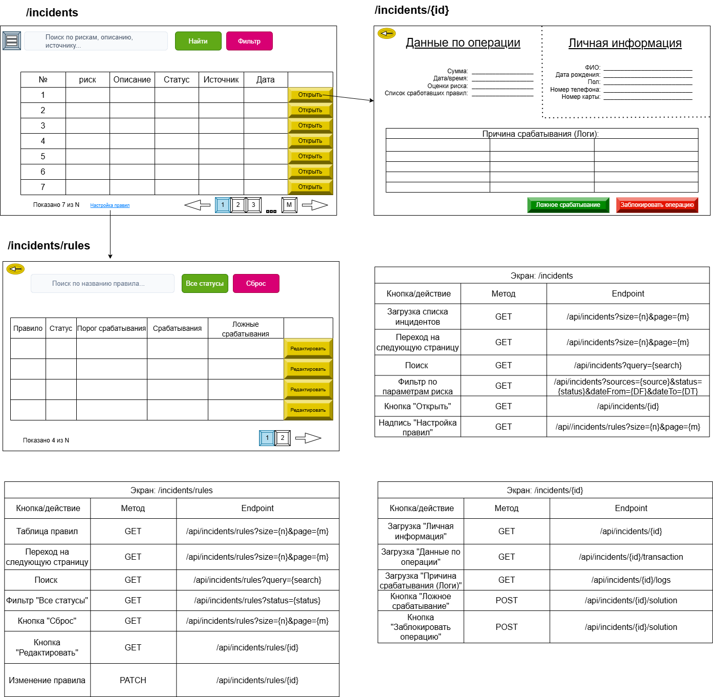

# UI и API интерфейса

Система предоставляет веб-интерфейс для аналитика и сотрудника службы ИБ. Ниже описаны основные экраны и соответствующие API-эндпоинты.

## 1. Экран `*/incidents` — список инцидентов

Предназначен для просмотра и фильтрации зарегистрированных инцидентов.

### Элементы интерфейса

- **Поле поиска** — по рискам, описанию, источнику.
- **Кнопка «Найти»** — запуск поискового запроса.
- **Кнопка «Фильтр»** — открытие панели фильтрации по параметрам.
- **Таблица инцидентов** со столбцами:
  - № (порядковый номер)
  - риск (уровень риска)
  - описание
  - статус
  - источник
  - дата
- **Кнопка «Открыть»** у каждой строки — переход к детальной карточке инцидента.
- **Пагинация** (номера страниц, стрелки «вперёд/назад»).
- **Ссылка «Настройка правил»** — переход к экрану управления правилами.

### API для этого экрана

| Кнопка / действие                     | Метод  | Эндпоинт                                           |
|---------------------------------------|--------|----------------------------------------------------|
| Загрузка списка инцидентов             | GET    | `/api/incidents?size={n}&page={m}`                |
| Переход на следующую страницу         | GET    | `/api/incidents?size={n}&page={m}`                |
| Поиск                                 | GET    | `/api/incidents?query={search}`                   |
| Фильтр по параметрам риска, статусу и дате | GET | `/api/incidents?sources={source}&status={status}&dateFrom={DF}&dateTo={DT}` |
| Кнопка «Открыть»                      | GET    | `/api/incidents/{id}`                             |
| Надпись «Настройка правил»            | GET    | `/api/incidents/rules?size={n}&page={m}`          |

---

## 2. Экран `*/incidents/{id}` — детальная карточка инцидента

Отображает полную информацию по выбранному инциденту и позволяет принять решение.

### Элементы интерфейса

- **Блок «Личная информация»**:
  - ФИО, дата рождения, пол, номер телефона, номер карты.
- **Блок «Данные по операции»**:
  - Сумма, дата/время, оценка риска, список сработавших правил.
- **Блок «Причина срабатывания (Логи)»** — таблица с логированием сработавших условий.
- **Кнопка «Ложное срабатывание»** — пометить инцидент как ложный.
- **Кнопка «Заблокировать операцию»** — инициировать блокировку транзакции.

### API для этого экрана

| Кнопка / действие                         | Метод  | Эндпоинт                         |
|-------------------------------------------|--------|----------------------------------|
| Загрузка личной информации и данных операции | GET    | `/api/incidents/{id}`          |
| Загрузка данных операции (отдельно)        | GET    | `/api/incidents/{id}/transaction` |
| Загрузка логов срабатывания                | GET    | `/api/incidents/{id}/logs`       |
| Кнопка «Ложное срабатывание»               | POST   | `/api/incidents/{id}/solution`   |
| Кнопка «Заблокировать операцию»            | POST   | `/api/incidents/{id}/solution`   |

> *Примечание:* оба действия используют один эндпоинт, но с разным телом запроса (тип решения).

---

## 3. Экран `*/incidents/rules` — управление правилами

Позволяет просматривать, искать и редактировать правила детекции.

### Элементы интерфейса

- **Поле поиска** — по названию правила.
- **Фильтр «Все статусы»** — отбор по статусу (активно/неактивно).
- **Кнопка «Сброс»** — очистка фильтров.
- **Таблица правил** со столбцами:
  - правило (название)
  - статус (активно/неактивно)
  - порог срабатывания
  - количество срабатываний
  - количество ложных срабатываний
- **Кнопка «Редактировать»** у каждой строки — открытие формы изменения правила.
- **Пагинация**.

### API для этого экрана

| Кнопка / действие                          | Метод  | Эндпоинт                                |
|--------------------------------------------|--------|-----------------------------------------|
| Таблица правил (загрузка)                  | GET    | `/api/incidents/rules?size={n}&page={m}` |
| Переход на следующую страницу              | GET    | `/api/incidents/rules?size={n}&page={m}` |
| Поиск                                      | GET    | `/api/incidents/rules?query={search}`    |
| Фильтр «Все статусы»                       | GET    | `/api/incidents/rules?status={status}`   |
| Кнопка «Сброс»                             | GET    | `/api/incidents/rules?size={n}&page={m}` |
| Кнопка «Редактировать»                     | GET    | `/api/incidents/rules/{id}`             |
| Изменение правила (сохранение)             | PATCH  | `/api/incidents/rules/{id}`             |

---

## Схема взаимодействия

Ниже на рисунке показана связь между экранами `/incidents`, `/incidents/{id}` и `/incidents/rules`, а также основные элементы управления.

**Картинка UI:** 

