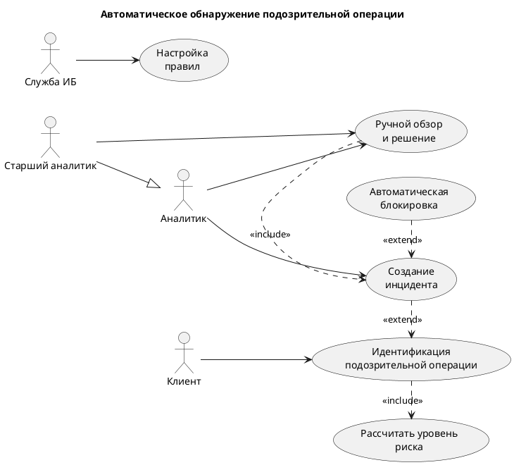

# Use-case и BPMN

## Диаграмма вариантов использования

Ниже представлена диаграмма вариантов использования для процесса автоматического обнаружения подозрительной операции, расчёта риска, формирования инцидента и последующего ручного рассмотрения.

# Акторы

1. **Клиент** — инициирует операции в системе дистанционного банковского обслуживания.
2. **Служба ИБ** — настраивает правила детекции и контролирует параметры срабатывания.
3. **Аналитик** — выполняет ручной обзор инцидентов и принимает решение по ним.
4. **Старший аналитик** — выполняет те же функции, что и аналитик, но может рассматривать более сложные или критичные случаи.

# Варианты использования

| Use Case | Описание | Акторы |
|----------|----------|--------|
| Идентификация подозрительной операции | Автоматическое выявление операции, которая может быть связана с мошенничеством или нетипичным поведением пользователя. | Клиент |
| Рассчитать уровень риска | Определение риска операции на основе правил, параметров транзакции и пользовательского контекста. | Система |
| Создание инцидента | Формирование инцидента при превышении установленного порога риска. | Система, Аналитик |
| Ручной обзор и решение | Аналитик просматривает инцидент и принимает решение: подтвердить, отклонить или передать дальше. | Аналитик, Старший аналитик |
| Автоматическая блокировка | Автоматическая реакция системы на высокорисковую операцию. | Система |
| Настройка правил | Изменение параметров правил детекции, порогов и условий срабатывания. | Служба ИБ |

# Связи между вариантами использования

1. **«Идентификация подозрительной операции»** включает **«Рассчитать уровень риска»** (`include`), так как расчёт риска является обязательной частью анализа.
2. **«Создание инцидента»** расширяет **«Идентификацию подозрительной операции»** (`extend`), так как инцидент создаётся только при высоком уровне риска.
3. **«Ручной обзор и решение»** включает **«Создание инцидента»** (`include`), поскольку инцидент должен быть зафиксирован до ручного анализа.
4. **«Автоматическая блокировка»** расширяет **«Создание инцидента»** (`extend`), так как блокировка применяется только в особых случаях.

# BPMN-схема процесса

BPMN-схема отражает основной поток обработки подозрительной операции: от поступления события из ДБО до анализа, создания инцидента и принятия решения аналитиком.

# Краткое описание процесса

1. Клиент совершает операцию в ДБО.
2. Событие передаётся в систему мониторинга.
3. Система сохраняет и анализирует событие.
4. Выполняется расчёт уровня риска.
5. При превышении порога создаётся инцидент.
6. Аналитик рассматривает инцидент и принимает решение.
7. Результат фиксируется в журнале инцидентов.

# Назначение BPMN

BPMN-схема используется для описания последовательности действий, точек принятия решений и альтернативных ветвей обработки при обнаружении подозрительной активности.

# Сценарии использования

Ниже приведены типовые сценарии работы с системой.

1. **Аналитик просматривает список недавно выявленных подозрительных операций**  
  Открывает список инцидентов, фильтрует по уровню риска и дате, переходит в карточку наиболее критичного инцидента.
2. **Служба ИБ получает инциденты высокого риска**  
  Выполняет первичную проверку: сопоставляет данные транзакции с профилем клиента, проверяет геолокацию и устройство.
3. **Руководство банка анализирует отчёты**  
  Просматривает сводку по предотвращённым потерям, качеству детекции (доля ложных срабатываний) и скорости обработки инцидентов.
4. **Регулятор получает агрегированную отчётность**  
  Запрашивает и получает стандартизированные отчёты о подозрительной активности за требуемый период.
5. **Клиент банка выполняет легитимные операции**  
  Проводит платежи и переводы без значительных задержек; система незаметно проверяет транзакции, и только действительно подозрительные операции направляются на дополнительную проверку.
