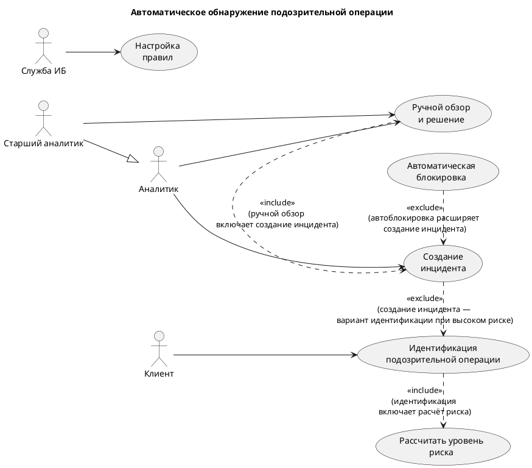
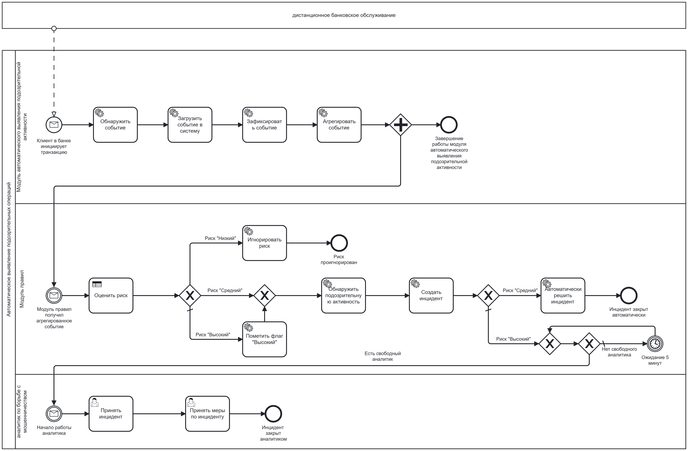

# Use-case и BPMN

## Диаграмма вариантов использования

Ниже представлена диаграмма, иллюстрирующая ключевые варианты использования системы мониторинга подозрительной активности.

### Акторы

- **Клиент** – инициирует операции в ДБО.
- **Служба ИБ** – настраивает правила детекции.
- **Аналитик** – выполняет ручной обзор инцидентов, принимает решения.
- **Старший аналитик** – наследует права аналитика, участвует в сложных решениях.

### Варианты использования

| Use Case                         | Описание                                                                                     | Акторы                          |
|----------------------------------|----------------------------------------------------------------------------------------------|----------------------------------|
| Идентификация подозрительной операции | Автоматическое выявление операций, потенциально связанных с отмыванием денег или мошенничеством. | Клиент (через свои действия)     |
| Рассчитать уровень риска        | Определение количественной оценки риска для каждой операции (включается в идентификацию).     | (автоматически, как часть UC_Detect) |
| Создание инцидента               | Формирование записи об инциденте при высоком уровне риска.                                   | Аналитик (через ручной обзор)    |
| Ручной обзор и решение           | Аналитик проверяет подозрительную операцию, принимает решение (блокировка/разрешение).       | Аналитик, Старший аналитик       |
| Автоматическая блокировка        | Система блокирует операцию без участия аналитика при экстремально высоком риске.             | (автоматически)                  |
| Настройка правил                 | Сотрудник ИБ изменяет пороги и параметры детекции.                                           | Служба ИБ                        |

### Связи между вариантами

- **«Идентификация подозрительной операции» включает «Рассчитать уровень риска»** (`<<include>>`) – расчёт риска является обязательной частью идентификации.
- **«Создание инцидента» расширяет «Идентификацию подозрительной операции»** (`<<extend>>`) – инцидент создаётся только при высоком риске.
- **«Ручной обзор и решение» включает «Создание инцидента»** (`<<include>>`) – при ручном разборе инцидент обязательно фиксируется.
- **«Автоматическая блокировка» расширяет «Создание инцидента»** (`<<extend>>`) – блокировка является особым случаем обработки инцидента.

## BPMN-схема процесса

Процесс автоматического обнаружения подозрительной операции и принятия решения представлен на диаграмме ниже.

